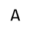

## intensity

<p align="center"></p>

This is a lightweight node library for calculating pixel intensity of characters based on Canvas, and it helps for asciifying pixels with different intensities of words.

It mainly uses Canvas to draw characters in a fixed area, and sum alpha values by each pixel to calculate the intensity. The width of the fixed area is corresponding to your given text, which means that it is only meaningful to compare two string items with the same length.

### Usages

1. Install the library at first:

    ```bash
    npm install --save @aleen42/intensity
    ```

2. Import it and use it to calculate the pixel intensity of a character, a word, or a sentence:

    ```js
    const intensity = require('@aleen42/intensity');
    intensity('a'); // => 0.04325019607843137
    intensity('A'); // => 0.04439529411764706
    
    new Array(126).fill('').map((v, i) => String.fromCharCode(i)) // Ascii
        .filter((v, i) => i >= 32) // filter by visible
        .sort((a, b) => intensity(a) - intensity(b)) // sort by pixel intensity
        .join('');
    // => " `-.':_,^\"!=><;*/\\+c?z7LvrT)(sJiC1xtFYI3|lZyf{}2eSo5unjV[]EwaPA4KXGk6h9UObdqpRHDM8$0#BmQWNg%&@"
    ```

### :fuelpump: How to contribute

Have an idea? Found a bug? See [how to contribute](https://wiki.aleen42.com/contribution.html).

### :scroll: License

[MIT](https://wiki.aleen42.com/MIT.html) © aleen42
